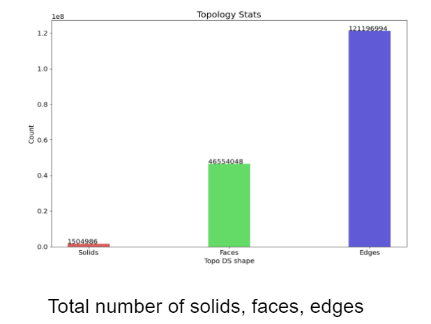
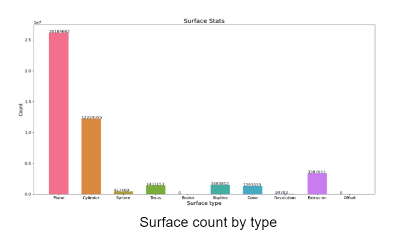
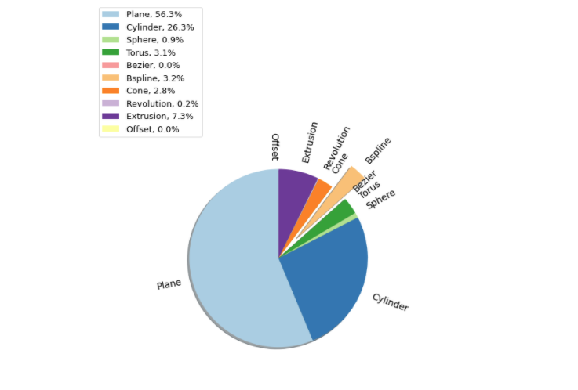
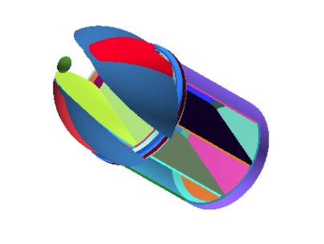
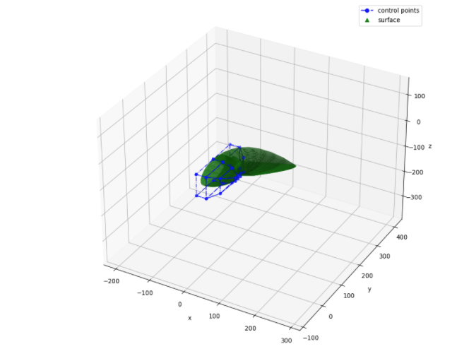
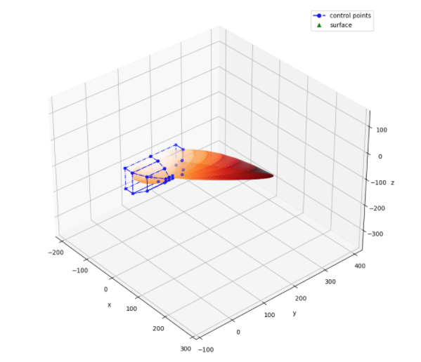

## STEPfileparser
This project is written specifically for parsing .STEP files and converting them into a much easier to work with .JSON format.

## Motivation
As part of my research, I needed a tool that could read .STEP files and convert them into something easier to work with like a .JSON file. This was super helpful for the dataset generation and analysing the statistics of the 1 million .STEP files present in the ABC Dataset.

## Tech/framework used
python, pythonOCC

<b>Built with</b>
- [pythonOCC](https://github.com/tpaviot/pythonocc-core)

## Features
Reading .STEP files and converting them into easier to manage formats like .JSON is extremely important for research in Geometric Deep Learning. When I started this, I could not find a lot of resources available for working with pythonOCC and the Open Cascade documentation was too vast to cover for a single-use project like this. I hope this provides some kind of template for anyone who has to work with large 3D datasets.

1. The tool allows for easy conversion of a .STEP file into a .JSON file format. 
2. In addition to basic surface information, there is also a function that takes care of holes present in the object's surface.

## Installation
For installation of the pythonOCC framework details, please refer https://github.com/tpaviot/pythonocc-core.

## Some Statistics obtained from ABC Dataset using the parser

## STEP file visualized along with extracted B-spline surfaces

